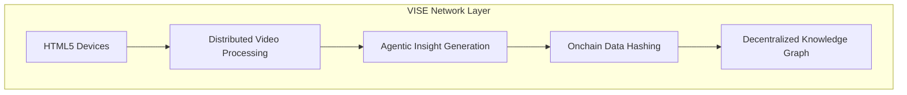

# SonicStand

  [Banner Image Placeholder - showing decentralized video curation network and insight visualization]

📖 [Documentation](#) | 🎯 [Demo](#) | 🔗 [Network Dashboard](#)

## 🌟 Overview

SonicStand reimagines decentralized curation through an Agentic DePIN network powered by VISE (Video Indexing & Sequencing Engine). Our solution achieves three core objectives:

1. **Narrative Balance**: Bridges traditional crypto values with modern agentic AI trends
2. **Onchain Participation**: Enables HTML5-capable devices to join a decentralized compute network
3. **Token Utility Proof**: Demonstrates real-world value for agent tokens through verifiable video insights

Built for the Sonic DeFAI Hackathon, SonicStand transforms video content into immutable, explorable knowledge graphs while maintaining computational inclusivity through our HTML5-first approach.

## ✨ Features

- 🌐 Decentralized Compute Network
- 📹 HTML5-Compatible VISE Engine
- 🔍 Agentic Insight Discovery
- 🔗 Onchain Data Integrity
- 🤖 Autonomous Curation Agents
- 📈 Tokenized Contribution Rewards

## 🚀 Technical Architecture

## 🎯 Use Cases

- 🔬 Onchain Researchers: Discover verifiable video insights
- 📡 Network Participants: Contribute compute resources
- 🛡️ Data Custodians: Curate immutable content records
- 🤖 AI Developers: Train models on decentralized datasets

## 📄 License

Distributed under the MIT License.

## 🏆 Hackathon Track

This project was built for the **Sonic DeFAI Hackathon**, emphasizing:

- Agentic DePIN Infrastructure
- Decentralized Video Intelligence
- Computational Inclusivity
- Immutable Content Provenance

## 👥 Team

- [Kelvin Praises](https://x.com/kelvinpraises) - Protocol Design ✘ Agent Architecture ✘ Fullstack Implementation

## 📊 Project Status

- [x] Core VISE Engine
- [x] HTML5 Compute Integration
- [x] Basic Agent Framework
- [x] Token Incentive Layer
- [ ] Advanced Curation DAO
